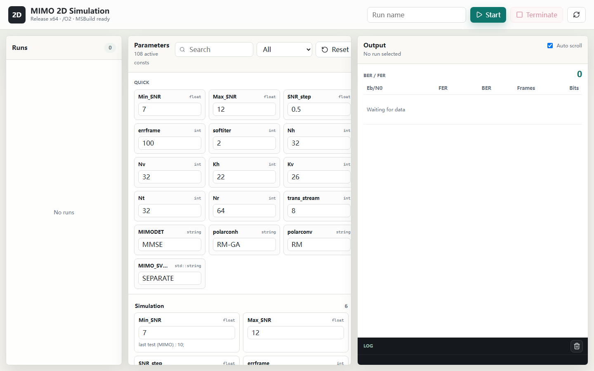
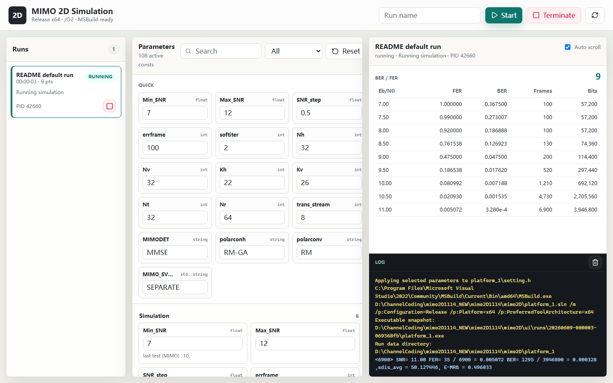

# MIMO 2D Polar Coding Simulation Platform

> 面向二维 Polar 编码 MIMO 通信系统的仿真平台，支持通过 Visual Studio C++ 后端运行 BLER/BER 曲线仿真，并提供 FastAPI Web UI 用于参数配置、编译、运行和实时观察结果。



## 项目概览

本项目用于评估 **二维编码 MIMO 系统** 在不同 `Eb/N0` 条件下的块错误率（BLER/FER）和比特错误率（BER）表现。核心仿真程序由 C++ 实现，主要围绕 Polar 编码、二维迭代译码、MIMO 检测、交织、功率分配等模块展开。

当前默认配置对应一个 2D Coding MIMO System：

| 项目 | 当前默认配置 |
| --- | --- |
| 编码维度 | 2D |
| 码长 | `N = 1024` |
| 信息位 | `K = 567` |
| 二维结构 | `Nh = 32`, `Nv = 32`, `Kh = 22`, `Kv = 26` |
| 极化构造 | 横向 `RM-GA`，纵向 `RM` |
| 调制 | 16QAM (`ModType = 4`) |
| MIMO 天线 | `Nt = 32`, `Nr = 64` |
| 传输流数 | `trans_stream = 8` |
| MIMO 检测 | `MMSE` |
| 译码 | SLD/SCL 组合，`L = 8`, `L_LSD = 32` |
| 软迭代 | `softiter = 2`, `Pyndiah` |
| 默认扫描范围 | `Eb/N0 = 7:0.5:12 dB` |

## 仿真目的

该平台主要用于研究二维 Polar 编码在 MIMO 场景下的误码性能和译码行为。通过调整码构造、交织方式、软迭代次数、MIMO 检测算法、功率分配策略和 SNR 扫描范围，可以观察不同设计选择对 BLER/BER 曲线的影响。

典型问题包括：

- `RM`、`GA`、`5G`、`RM-GA` 等构造方式在二维结构中的性能差异
- 软迭代次数 `T_soft` 对 BLER/BER 收敛的影响
- 空时交织、部分交织、全交织对错误传播的影响
- MMSE、K-best、EP 等检测方式在高维 MIMO 下的复杂度与性能折中
- 非均匀信道、SVD 预编码、功率分配对可靠性的改善

## 系统与编码方式

平台模拟的是一个结合 Polar 编码和 MIMO 检测的二维通信系统。二维编码结构将码字组织为横向和纵向两个方向，分别配置构造方式与译码策略。系统支持：

| 模块 | 说明 |
| --- | --- |
| Polar 编码 | 支持 1D/2D Polar 编码结构 |
| Polar 构造 | `RM`, `GA`, `5G`, `beta`, `RM-GA` |
| 二维译码 | 横向/纵向迭代译码，支持软信息交换 |
| SCL/SLD | 列表译码与 LSD 相关流程 |
| MIMO 检测 | `MMSE`, `KBEST`, `EP` 等检测配置 |
| 调制 | 当前默认 16QAM，也可通过 `ModType` 调整 |
| 交织 | 空间交织、时间交织、部分空时交织、块交织 |
| 结果统计 | 输出不同 `Eb/N0` 下 FER/BER 曲线 |

## 主要可配置参数

所有 C++ 仿真参数集中在：

```text
platform_1/setting.h
```

UI 会自动解析当前启用的 `const` 参数，并允许在网页中编辑。主要参数如下。

### 编码参数

| 参数 | 含义 |
| --- | --- |
| `dimensions` | 编码维度，`1` 或 `2` |
| `N`, `K` | 总码长和信息位长度 |
| `Nh`, `Nv` | 二维码横向/纵向尺寸 |
| `Kh`, `Kv` | 横向/纵向信息维度 |
| `polarcon` | 一维构造方式 |
| `polarconh`, `polarconv` | 二维横向/纵向构造方式 |
| `sys` | 是否使用系统码形式 |
| `irregular_coding` | 是否启用非规则编码 |

### MIMO 与调制参数

| 参数 | 含义 |
| --- | --- |
| `Nt`, `Nr` | 发射/接收天线数量 |
| `trans_stream` | 传输流数量 |
| `ModType` | 调制阶数参数 |
| `MOD_DIM` | 空间或时间调制方式 |
| `MIMODET` | MIMO 检测算法 |
| `K_KBEST` | K-best 检测列表宽度 |
| `iter_MIMO` | EP 检测迭代次数 |
| `mimo_llr_thres` | MIMO LLR 阈值 |

### 迭代译码与列表参数

| 参数 | 含义 |
| --- | --- |
| `softiter` | 软迭代次数 |
| `softmethod` | 软信息更新方法 |
| `alpha`, `beta` | Pyndiah/MITSO 相关权重 |
| `L` | SCL list size |
| `L_LSD` | LSD list size |
| `L_MIMO_BLK` | MIMO block list 参数 |
| `half_iter` | 是否启用半迭代 |
| `max_llr_ratio` | LLR 限幅相关参数 |

### 交织参数

| 参数 | 含义 |
| --- | --- |
| `flag_interleave` | 是否启用交织 |
| `flag_interleave_all` | 是否全交织 |
| `flag_interleave_partial` | 是否部分空时交织 |
| `flag_interleave_spatial` | 是否空间交织 |
| `flag_interleave_block` | 是否块交织 |
| `interleave_rows` | 交织行数 |

### 仿真控制参数

| 参数 | 含义 |
| --- | --- |
| `Min_SNR` | 起始 `Eb/N0` |
| `Max_SNR` | 终止 `Eb/N0` |
| `SNR_step` | 扫描步长 |
| `errframe` | 每个 SNR 点目标错误帧数 |
| `record_frames` | 记录间隔 |
| `system_archi` | `SDD` 或 `JDD` |

## 项目结构

```text
.
├── platform_1.sln                  # Visual Studio solution
├── platform_1/                     # C++ simulation project
│   ├── main.cpp                    # 仿真入口
│   ├── setting.h                   # 全局仿真参数
│   ├── system.cpp                  # 1D/2D 系统级仿真流程
│   ├── MIMO_Function.cpp/.h        # MIMO 检测与信道相关函数
│   ├── Polar_*.cpp/.h              # Polar 编码、构造、译码模块
│   ├── LSDecode.cpp/.h             # LSD/list sphere decoding
│   ├── crc*.cpp/.h                 # CRC 与列表 CRC 相关逻辑
│   ├── ResFinal/                   # 仿真结果输出目录
│   └── result0512/fig/             # 论文/报告绘图 tex 文件
├── eigen3/                         # Eigen 依赖，本地保留，不纳入同步
├── ui/                             # FastAPI Web UI
│   ├── app.py                      # 后端：参数解析、编译、运行、日志流
│   ├── start_ui.ps1                # Windows 启动脚本
│   ├── requirements.txt            # Python 依赖
│   ├── static/
│   │   ├── index.html              # UI 页面
│   │   ├── styles.css              # UI 样式
│   │   └── app.js                  # 前端交互逻辑
│   └── runs/                       # 每次 UI run 的快照目录
├── docs/
│   ├── ui-start-screen.png         # UI 启动界面截图
│   └── ui-running-screen.png       # UI 运行中截图
└── .gitignore
```

## 编译方式

本项目使用 Visual Studio/MSBuild 编译。Release x64 配置已开启 MSVC `/O2` 优化，对应项目文件中的：

```xml
<Optimization>MaxSpeed</Optimization>
```

手动编译命令：

```powershell
& "C:\Program Files\Microsoft Visual Studio\2022\Community\MSBuild\Current\Bin\amd64\MSBuild.exe" `
  platform_1.sln `
  /m `
  /p:Configuration=Release `
  /p:Platform=x64 `
  /p:PreferredToolArchitecture=x64
```

生成的可执行文件：

```text
x64/Release/platform_1.exe
```

## UI 启动方式

进入 `ui/` 目录安装依赖：

```powershell
cd ui
python -m pip install -r requirements.txt
```

启动服务：

```powershell
.\start_ui.ps1
```

浏览器打开：

```text
http://127.0.0.1:8000
```

UI 会执行以下流程：

1. 读取 `platform_1/setting.h` 中当前启用的参数
2. 在网页中编辑参数并点击 `Start`
3. 自动改写 `setting.h`
4. 使用 MSBuild 编译 `Release|x64`
5. 复制本次生成的 exe 到 `ui/runs/<run-id>/`
6. 启动仿真并实时捕获 stdout/stderr
7. 从输出中解析 `Eb/N0`、FER、BER 并更新表格
8. 可在 UI 中终止正在运行的任务

## UI 界面

### 启动界面


### 运行中界面



## 输出与结果

仿真运行时会持续输出类似以下信息：

```text
<31220> SNR= 11.50 FER= 23 / 31220 = 0.000737 BER= 898 / 17857840 = 0.000050
```

UI 会从中解析：

- `Eb/N0`
- FER/BLER
- BER
- 累计帧数
- 累计比特数

结果可用于绘制不同编码构造、迭代次数、检测算法和交织策略下的性能曲线。

## 研究意义

二维 Polar 编码将编码结构扩展到横向和纵向两个维度，使系统能够在 MIMO 多流传输中探索更丰富的可靠性分配、交织和迭代译码策略。该平台的意义在于：

- 快速比较不同 Polar 构造方法的 BLER/BER 性能
- 验证二维软迭代译码在高维 MIMO 场景中的收益
- 观察 MIMO 检测与 Polar 译码之间的软信息交互行为
- 为论文图表、参数搜索和算法改进提供可复现实验入口
- 通过 Web UI 降低重复改参数、编译、运行、看日志的操作成本

## 注意事项

- 当前工程依赖 Visual Studio 2022/MSBuild。
- Release x64 编译使用 `/O2` 优化。
- `setting.h` 是仿真参数的真实来源；UI 启动 run 时会改写该文件。
- 大型输出、exe、VS 缓存和日志由 `.gitignore` 排除。
- 若需要长期并行运行多个仿真，建议为每个 run 规划独立输出目录，避免 C++ 程序共享写结果文件。
